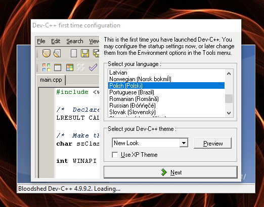
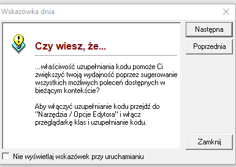

# Wstęp

## Czemu warto uczyć się C?

Język C został stworzony do pisania systemów operacyjnych. Jednak z czasem, C znalazło swoje miejsce praktycznie wszędzie - od Internetu (Emscripten) po mikrokontrolery (AVR-GCC) aż do aplikacji desktopowych i systemów operacyjnych. C jest bardzo uniwersalnym językiem.

Wbrew pozorom, C++ **nie** jest rozszerzeniem do C, lecz oddzielnym językiem który "wyrósł" z języka C. Obecnie, chociażby używanie funkcji z biblioteki standardowej C w C++ jest niezalecane, tak samo jak np. manipulacja surowymi wskaźnikami (raw pointers).

C mimo swojego wieku nadal szczyci się tytułem "lingua franca" w programowaniu. Większość algorytmów jest przedstawiana właśnie w C (po czym mistrzowie pythona chcą to przetłumaczyć na swój język, i zaliczają solidny upadek pytając się o podstawy tego języka).

W momencie w którym to piszę, C jest drugim najpopularniejszym językiem który jest w użytku zdaniem [TIOBE index](https://www.tiobe.com/tiobe-index/), tuż za językiem Java. Popularność C ciągle rośnie w ogromnym tempie (8% zmiany rocznie, Java ma 0,4% więcej udziału od C). Tuż za C znajduje się C++, Python, C#.

W tej książce przedstawię również język Assemblera który nie jest już tak popularny (16 miejsce w rankingu, żeby było śmiesznie dwa miejsca przed Go), mimo to jest to wspaniały język do tworzenia niezwykle wydajnych aplikacji. Przykład? Proszę bardzo. [Ten](speed.asm) plik zawierający źródło assemblera na mojej maszynie **13,7** GFLOPS, czyli 13,7 MILIARDA operacji zmiennoprzecinkowych na sekundę.

UWAGA: Jeśli zechcesz uruchomić ten program, podkręć sobie chłodzenie i co chwilę sprawdzaj temperaturę procesora. Może on wyrządzić szkody (np. spalić procesor); ten program może nie działać out of the box, ale jego zasada działania jest bardzo łatwo zauważalna i można w różne sposoby udowodnić rzeczywistą prędkość zastosowanej metody.

Mam nadzieję, że udało mi się Ciebie zachęcić do nauki C oraz Assemblera. Są to dwa wspaniałe języki które musisz poznać, jeśli chcesz rozpocząć swoją karierę programisty w prawidłowy sposób.

## O języku

Z definicji, C to imperatywny, strukturalny język programowania wysokiego poziomu stworzony na początku '70 przez Dennisa Ritchiego do programowania systemów operacyjnych i innych zadań niskiego poziomu.

Poprzednikiem języka C był interpretowany język B, który Ritchie rozwinął w język C. Pierwszy okres rozwoju języka to lata 1969–1973. W roku 1973 w języku C udało się zaimplementować jądro systemu operacyjnego Unix. W 1978 roku Brian Kernighan i Dennis Ritchie opublikowali dokumentację języka pt. C Programming Language (wydanie polskie: Język C). Wersję języka opisywaną w ich książce nazwano "K&R C", i uznano ją za "lowest common denominator" - jeśli jakaś platforma wspiera C, na 100% wspiera K&R C.

W 1983 roku ANSI powołało komitet X3J11 w celu ustanowienia standardu języka C. Standard został zatwierdzony w 1989 roku jako ANSI X3.159-1989 "Programming Language C". Ta wersja języka jest określana nieformalnie jako ANSI C, standardowe C lub C89. Jest to najczęściej używany standard C.

1990 roku standard ANSI C został zaadoptowany przez ISO jako norma ISO/IEC 9899:1990. Ta wersja jest potocznie nazywana C90. Ponieważ normy wydane przez oba ciała standaryzacyjne są identyczne, wobec tego potoczne określenia C89 oraz C90 dotyczą tej samej wersji języka C. W 1999 roku ISO opublikowało normę ISO/IEC 9899:1999, język zgodny z tą normą jest nieformalnie nazywany C99. Ostatnia norma została opublikowana w 2011 roku pod nazwą ISO/IEC 9899:2011. Ta wersja języka jest potocznie nazywana C11 (C1X przed opublikowaniem normy). C90, C99 i C11 nie są tak często używane.

C posiada 13 typów podstawowych i 34 słów kluczowych (C89) - jest to bardzo prosty język.

## Jak używać kompilatora?

Uwaga: Zakładam że masz średnio rozbudowaną wiedzę informatyczną (tj. taką, która pozwala np. na korzystanie z powłoki)

Przez długi czas nie będziesz potrzebował używać kompilatora bezpośrednio (tj. z wiersza polecenia używanego przez ciebie systemu operacyjnego). Zamiast tego, lepiej jest pobrać wyspecjalizowane środowisko, któro pomoże Ci w programowaniu. Zawsze będzie ci prościej kliknąć jeden przycisk zamiast wpisywać długie komendy w wierszu polecenia i ręcznie tworzyć pliki budujące twoją aplikację. **Uwaga: Dev-C++, CodeBlocks, MSVC++ to NIE KOMPILATORY, kompilatorem jest np. GCC, którego będziemy używać.** Środowisko, czyli np. Dev-C++, to program w którym piszemy nasze programy (coś jak dokumenty w Wordzie). Edytorem jest np. Notepad++, którego osobiście używam.

W tej książce będę opisywał środowisko znane również jako Dev-C++. Możesz je pobrać z [tu](https://downloads.sourceforge.net/project/dev-cpp/Binaries/Dev-C%2B%2B%204.9.9.2/devcpp-4.9.9.2_setup.exe?r=https%3A%2F%2Fsourceforge.net%2Fprojects%2Fdev-cpp%2Ffiles%2FBinaries%2FDev-C%252B%252B%25204.9.9.2%2Fdevcpp-4.9.9.2_setup.exe%2Fdownload&ts=1529244990).

Uwaga: Jeśli jesteś doświadczonym programistą i nie lubisz Dev-C++ - to nie jest środowisko którym trzeba posługiwać się do końca życia. Orwell Dev-C++ jest znośne, aczkolwiek Bloodsheed Dev-C++ jest bardziej popularne - stąd bierze się zła sława Dev'a.

Jeśli jesteś natomiast początkującym programistą, radzę Ci zmienić potem środowisko, na np. Microsoft Visual C++ lub po prostu posługiwać się konsolą i edytorem.

Jeśli jesteś programistą który zna już inny język, możesz spokojnie zainstalować inne środowisko i się do niego dostosować (bo zakładam, że potrafisz).

Uwaga: Nie sugeruj się nazwą! Dev-C++ można używać do programowania w C.

Po uruchomieniu rozpocznie się konfiguracja.

Po kliknięciu "Next >" pojawi się dialog, w którym należy zaznaczyć 'Yes, I want to use this feature'. Na następnej stronie nie czynimy zmian i klikamy "Next >". Rozpocznie się cachowanie plików. Następnie zaznaczamy OK. Dev-C++ zostanie uruchomione.

W okienku wskazówek możemy znaleźć ciekawe informacje.

Z menu Plik wybieramy opcję Nowy, a następnie Plik Źródłowy. Teraz, umiesz już obsłużyć w podstawowym stopniu IDE.

**[Powrót do spisu treści](..)**
